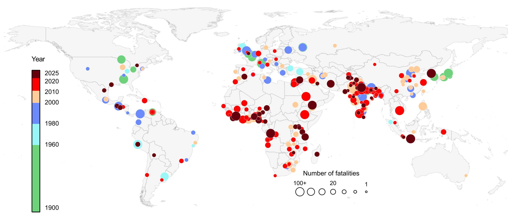

# crowd-accidents

List of crowd accidents from 1900 to 2024.

Source: [Zenodo record 19483010](https://zenodo.org/records/19483010) — DOI [10.5281/zenodo.19483010](https://doi.org/10.5281/zenodo.19483010).

## Description

This dataset compiles information on crowd accidents occurring globally between 1900 and 2024. The collection focuses on incidents with at least one fatality. Compared to the previous version, it extends the timeframe through 2024 and incorporates 132 newly identified accidents.

The dataset includes standardized dates, countries, and locations. Casualty figures are reported using expressions found in the referenced sources, while recent entries underwent AI-assisted generation followed by verification.

## Files

| File | Description |
| --- | --- |
| `accident_data_raw.csv` | Complete accident information with word-based casualty data |
| `accident_data_numeric.csv` | Numeric-converted casualty data |
| `number_conversion.csv` | Conversion scheme documentation |
| `references/` | Source materials for each accident |
| `gis_data/` | Shapefiles for mapping applications |

## Citation

If you use this dataset, please cite it. See [`CITATION.cff`](CITATION.cff) or use:

> Feliciani, C. (2026). *List of crowd accidents from 1900 to 2024* (v2) [Data set]. Zenodo. https://doi.org/10.5281/zenodo.19483010

## License

The dataset is distributed under the [Creative Commons Attribution 4.0 International (CC BY 4.0)](https://creativecommons.org/licenses/by/4.0/) license.
